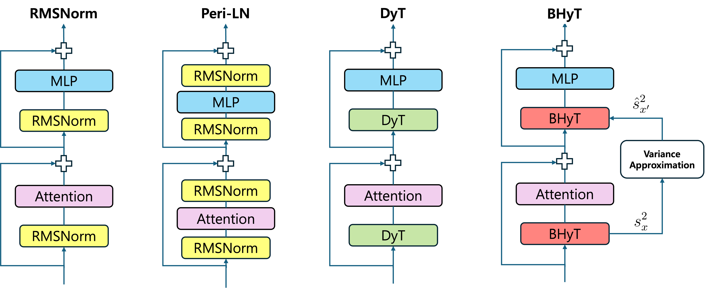
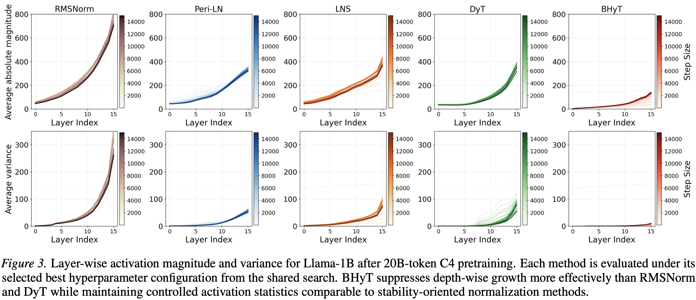
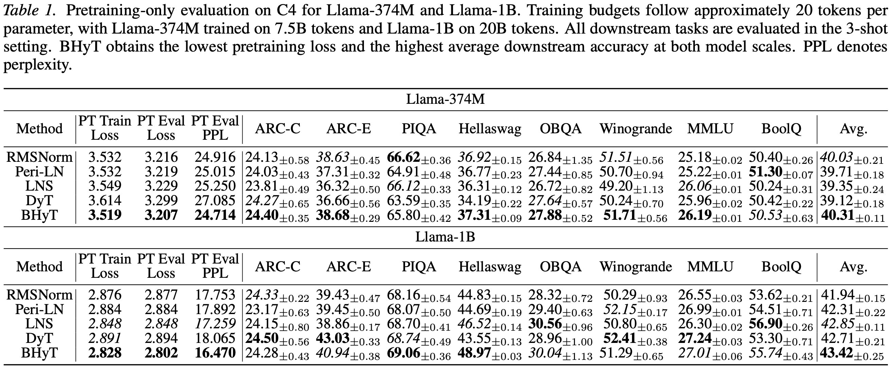
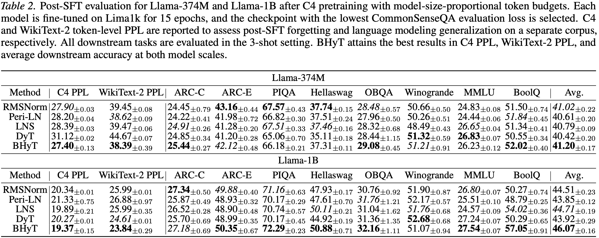
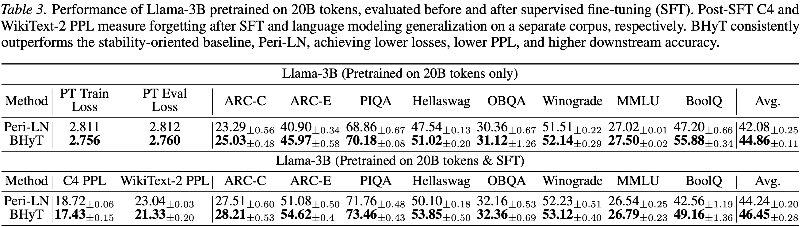

# Bounded Hyperbolic Tangent: A Stable and Efficient Alternative to Pre-Layer Normalization in Large Language Models
This repository is the official implementation of "Bounded Hyperbolic Tangent: A Stable and Efficient Alternative to Pre-Layer Normalization in Large Language Models", accepted at ICML 2026.

Pre-Layer Normalization (Pre-LN) is the de facto choice for large language models (LLMs) and is crucial for stable pretraining and effective transfer learning. However, Pre-LN is inefficient due to repeated statistical calculations and suffers from the curse of depth. As layers grow, the magnitude and variance of the hidden states escalate, destabilizing training. Efficiency-oriented normalization-free methods such as Dynamic Tanh (DyT) improve speed but remain fragile at depth. To jointly address stability and efficiency, we propose Bounded Hyperbolic Tanh (BHyT), a drop-in replacement for Pre-LN. BHyT couples a tanh nonlinearity with explicit, data-driven input bounding to keep activations within a non-saturating range. It prevents depth-wise growth in activation magnitude and variance and comes with a theoretical stability guarantee. For efficiency, BHyT computes exact statistics once per block and replaces a second normalization with a lightweight variance approximation, enhancing efficiency. Empirically, BHyT demonstrates improved stability and efficiency during pretraining, achieving an average of 1.6\% faster training and an average of 1.77\% higher token generation throughput compared to RMSNorm, while maintaining strong pretraining-only and post-SFT performance across language understanding and reasoning benchmarks

<p align="center">
  
</p>

## Requirements
Pytorch version: 2.7.1+cu118\
Python version: 3.11\
transformers: 4.51.3

```python
pip install -r requirements.txt
pip install -e ".[torch,metrics]" --no-build-isolation
pip install flash-attn
```

## Pretraining
```bash
bash scripts/bhyt/pt_bhyt_sweep.sh {GPU} {MODEL_SIZE}
```

MODEL_SIZE: {1b, 3b}

### Pretraining with specific hyperparameters for BHyT
#### Parallel Execution
Executing BHyT module concurrently with other Transformer sub-layers
```bash
bash scripts/bhyt/pt_bhyt_sweep.sh {GPU} {MODEL_SIZE} {ILLAM} {PLLAM} {LLLAM}
```
MODEL_SIZE: {1b, 3b}\
ILLAM: INPUT_LAYER_LAM_RANGE, {1-5}\
PLLAM: POST_LAYER_LAM_RANGE, {1-5}\
LLAM: LAST_LAYER_LAM_RANGE, {1-5}

#### Line-by-Line Execution
Executing BHyT sequentially after each Transformer sub-layer
```bash
bash scripts/bhyt/pt_bhytline_sweep.sh {GPU} {MODEL_SIZE} {ILLAM} {PLLAM} {LLLAM}
```
MODEL_SIZE: {1b, 3b}\
ILLAM: INPUT_LAYER_LAM_RANGE, {1-5}\
PLLAM: POST_LAYER_LAM_RANGE, {1-5}\
LLAM: LAST_LAYER_LAM_RANGE, {1-5}

**Note:** In practice, the value of **PLLAM** is replaced by **ILLAM**

## SFT
Fine-tune a pretrained BHyT checkpoint (the PT `output_dir` from above). Both LoRA and full fine-tuning are supported.

### LoRA SFT
```bash
bash scripts/bhyt/{SFT_NAME}/sft_lora_sweep_1b.sh {GPU} {NORM_TYPE} {PT_CHECKPOINT_DIR}
```
SFT_NAME: {lima1k, com170k}\
NORM_TYPE: {bhyt, bhytline}

### Full SFT
```bash
bash scripts/bhyt/lima1k/sft_full_1b.sh {GPU} {NORM_TYPE} {PT_CHECKPOINT_DIR}
```
NORM_TYPE: {bhyt, bhytline, bhytstar}

> The `commonsense_170k` dataset is not bundled — download `commonsense_170k.json` into `data/` (it is registered in `data/dataset_info.json`). `lima1k` and the evaluation set are included; `c4_en` is streamed from the Hugging Face Hub.

## Evaluation
Evaluation uses the [EleutherAI lm-evaluation-harness](https://github.com/EleutherAI/lm-evaluation-harness). Install it first:
```bash
git clone https://github.com/EleutherAI/lm-evaluation-harness
cd lm-evaluation-harness && pip install -e . && cd -
```
BHyT checkpoints carry their custom modeling code (`auto_map`), so evaluation runs with stock `lm_eval` via `trust_remote_code=True` — no patching of the harness is required.

### Pretrained (PT) model evaluation
```bash
bash scripts/bhyt/eval/pt_eval.sh {GPU} {PT_CHECKPOINT_DIR} [NUM_FEWSHOT]
```

### Full-SFT model evaluation
```bash
bash scripts/bhyt/eval/sft_eval.sh {GPU} {SFT_CHECKPOINT_DIR} [NUM_FEWSHOT]
```
Both evaluate on: `arc_challenge, arc_easy, piqa, hellaswag, openbookqa, winogrande, mmlu, boolq`.

## Inference
During generation (KV-cache decoding), BHyT automatically precomputes its per-layer scalars (`λ·1/κ` and the variance-approximation constant) in the activation dtype on the first decode step. This is mathematically exact (greedy decoding is identical) and removes redundant scalar multiplications/casts on the decode hot path — no flag is required. Standard `model.generate(...)` benefits transparently.

## Results
### Layer-wise analysis of output statistics
<p align="center">
  
</p>

### Pretraining Results
Our experiments demonstrate that BHyT achieves superior stability and efficiency compared to traditional Pre-LN and other normalization-free methods:

<p align="center">
  
</p>

### SFT Results
BHyT demonstrates consistent improvements in supervised fine-tuning tasks across different model sizes and datasets:

<p align="center">
  
</p>

### Performance of Llama-3B pretrained on 20B tokens.

<p align="center">
  
</p>

## Base code of this repository.
This repository is based on [LLaMA-Factory](https://github.com/hiyouga/LLaMA-Factory) and [lm-evaluation-harness](https://github.com/EleutherAI/lm-evaluation-harness)